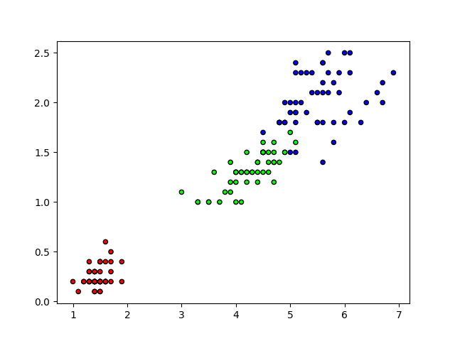

# KNN from Scratch

This project implements the K-Nearest Neighbors (KNN) algorithm from scratch in Python. The KNN algorithm is a simple, supervised machine learning algorithm that can be used for both classification and regression tasks. This implementation focuses on the classification task using the Iris dataset from the `sklearn` library.

## Table of Contents

- [Introduction](#introduction)
- [Installation](#installation)
- [Usage](#usage)
- [Explanation of Code](#explanation-of-code)
  - [train.py](#trainpy)
  - [KNN.py](#knnpy)
- [Results](#results)

## Introduction

K-Nearest Neighbors (KNN) is one of the simplest machine learning algorithms. It is a non-parametric method used for classification and regression. In both cases, the input consists of the k closest training examples in the feature space. In this project, we demonstrate how to implement the KNN algorithm from scratch and apply it to the Iris dataset.

## Installation

To run this project, you'll need to have Python installed along with the following libraries:

- numpy
- scikit-learn
- matplotlib

You can install these dependencies using pip:

```bash
pip install numpy scikit-learn matplotlib
```

## Usage

To run the KNN algorithm on the Iris dataset, simply execute the `train.py` file:

```bash
python train.py
```

This script will load the Iris dataset, split it into training and testing sets, fit the KNN model on the training data, make predictions on the test data, and print the accuracy of the model.

## Explanation of Code

### train.py

This file contains the main script for running the KNN algorithm on the Iris dataset.

```python
import numpy as np
from sklearn import datasets
from sklearn.model_selection import train_test_split
import matplotlib.pyplot as plt
from matplotlib.colors import ListedColormap
from KNN import KNN
```

- **Imports**: Import necessary libraries and the custom KNN class from `KNN.py`.

```python
cmap = ListedColormap(['#FF0000', '#00FF00', '#0000FF'])
```

- **Colormap**: Define a colormap for visualizing the Iris dataset.

```python
iris = datasets.load_iris()
X, y = iris.data, iris.target
```

- **Load Data**: Load the Iris dataset and separate the features (X) and labels (y).

```python
X_train, X_test, y_train, y_test = train_test_split(X, y, test_size = 0.2, random_state = 1234)
```

- **Split Data**: Split the data into training and testing sets.

```python
plt.figure()
plt.scatter(X[:,2], X[:,3], c = y, cmap = cmap, edgecolor = 'k', s = 20)
plt.show()
```

- **Plot Data**: Visualize the Iris dataset by plotting two of its features.

```python
clf = KNN(k = 5)
clf.fit(X_train, y_train)
predictions = clf.predict(X_test)
```

- **Train and Predict**: Initialize the KNN classifier, fit it to the training data, and make predictions on the test data.

```python
acc = np.sum(predictions == y_test) / len(y_test)
print(acc)
```

- **Calculate Accuracy**: Calculate and print the accuracy of the model.

### KNN.py

This file contains the implementation of the KNN algorithm.

```python
import numpy as np
from collections import Counter
```

- **Imports**: Import necessary libraries.

```python
def euclidean_distance(x1, x2):
    distance = np.sqrt(np.sum((x1 - x2) ** 2))
    return distance
```

- **Euclidean Distance**: Define a function to calculate the Euclidean distance between two points.

```python
class KNN:
    def __init__(self, k=3):
        self.k = k
```

- **Initialize KNN**: Define the KNN class with an initialization method that sets the number of neighbors (k).

```python
    def fit(self, X, y):
        self.X_train = X
        self.y_train = y
```

- **Fit Method**: Define the `fit` method to store the training data.

```python
    def predict(self, X):
        predictions = [self._predict(x) for x in X]
        return predictions
```

- **Predict Method**: Define the `predict` method to make predictions on new data.

```python
    def _predict(self, x):
        distances = [euclidean_distance(x, x_train) for x_train in self.X_train]
        k_indices = np.argsort(distances)[: self.k]
        k_neartest_labels = [self.y_train[i] for i in k_indices]
        most_common = Counter(k_neartest_labels).most_common()
        return most_common[0][0]
```

- **_Predict Method**: Define a private method to calculate distances from a point to all training points, select the nearest neighbors, and return the most common label.

## Results

Running the `train.py` script will print the predicted labels for the test set and the accuracy of the KNN model. Additionally, it will visualize the Iris dataset.

# OUTPUT
