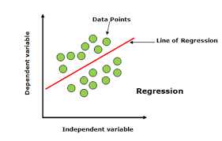

# Linear Regression
Linear regression is a supervised machine learning method that uses a linear equation to model the relationship between variables and predict future values:
## Explanation.
Linear regression uses known data to predict the value of unknown data. It does this by fitting a line to data points using a mathematical criterion, like ordinary least squares, that minimizes the sum of squared differences between the line and the data. The line can then be used to predict future values.

## Examples
For example, if you have data about your income and expenses for the past year, linear regression can determine that your expenses are half your income. It can then calculate an unknown future expense by halving a future known income.
