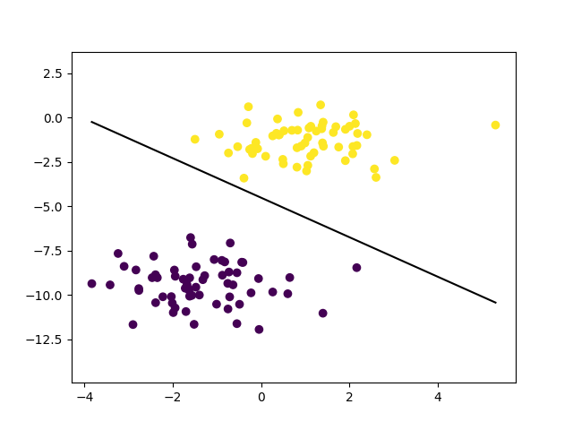

# perceptron.py

## What is Perceptron?
A neural network link that contains computations to track features and uses Artificial Intelligence in the input data is known as Perceptron. This neural links to the artificial neurons using simple logic gates with binary outputs. An artificial neuron invokes the mathematical function and has node, input, weights, and output equivalent to the cell nucleus, dendrites, synapse, and axon, respectively, compared to a biological neuron. 


#### 1. Imports and Helper Function
```python
import numpy as np

def unit_step_func(x):
    return np.where(x > 0, 1, 0)
```
- **Purpose**: Imports necessary libraries and defines a step function (`unit_step_func`) that returns 1 where `x > 0` and 0 otherwise. This is used as the activation function for the perceptron.

#### 2. Perceptron Class Definition
```python
class Perceptron:
    def __init__(self, learning_rate=0.01, n_iters=1000):
        self.lr = learning_rate
        self.n_iters = n_iters
        self.activation_func = unit_step_func
        self.weights = None
        self.bias = None
```
- **Purpose**: Defines the `Perceptron` class with an initializer (`__init__`) that sets up the learning rate, number of iterations, activation function, and initializes weights and bias to `None`.

#### 3. Fit Method
```python
    def fit(self, X, y):
        n_samples, n_features = X.shape

        # Initialize parameters
        self.weights = np.zeros(n_features)
        self.bias = 0

        y_ = np.where(y > 0, 1, 0)

        # Learn weights
        for _ in range(self.n_iters):
            for idx, x_i in enumerate(X):
                linear_output = np.dot(x_i, self.weights) + self.bias
                y_predicted = self.activation_func(linear_output)

                # Perceptron Update rule
                update = self.lr * (y_[idx] - y_predicted)
                self.weights += update * x_i
                self.bias += update
```
- **Purpose**: The `fit` method trains the perceptron model using input data (`X`) and labels (`y`). It initializes weights and bias, then iteratively adjusts them based on prediction errors using the perceptron update rule.

#### 4. Predict Method
```python
    def predict(self, X):
        linear_output = np.dot(X, self.weights) + self.bias
        y_predicted = self.activation_func(linear_output)
        return y_predicted
```
- **Purpose**: The `predict` method uses the learned weights and bias to predict outputs for new input data (`X`) by computing a linear combination and applying the activation function.

#### 5. Testing and Visualization
```python
if __name__ == "__main__":
    # Imports
    import matplotlib.pyplot as plt
    from sklearn.model_selection import train_test_split
    from sklearn import datasets

    # Define accuracy function
    def accuracy(y_true, y_pred):
        accuracy = np.sum(y_true == y_pred) / len(y_true)
        return accuracy
    
    # Generate sample data
    X, y = datasets.make_blobs(n_samples=150, n_features=2, centers=2, cluster_std=1.05, random_state=2)
    X_train, X_test, y_train, y_test = train_test_split(X, y, test_size=0.2, random_state=123)

    # Initialize and train the perceptron
    p = Perceptron(learning_rate=0.01, n_iters=1000)
    p.fit(X_train, y_train)
    predictions = p.predict(X_test)

    # Print accuracy
    print("Perceptron Classification accuracy", accuracy(y_test, predictions))

    # Plot data and decision boundary
    fig = plt.figure()
    ax = fig.add_subplot(1, 1, 1)
    plt.scatter(X_train[:, 0], X_train[:, 1], marker="o", c=y_train)

    x0_1 = np.amin(X_train[:, 0])
    x0_2 = np.amax(X_train[:, 0])

    x1_1 = (-p.weights[0] * x0_1 - p.bias) / p.weights[1]
    x1_2 = (-p.weights[0] * x0_2 - p.bias) / p.weights[1]

    ax.plot([x0_1, x0_2], [x1_1, x1_2], "k")

    ymin = np.amin(X_train[:, 1])
    ymax = np.amax(X_train[:, 1])
    ax.set_ylim([ymin - 3, ymax + 3])

    plt.show()
```
- **Purpose**: This section tests the perceptron implementation. It imports necessary libraries, generates sample data using `sklearn.datasets.make_blobs`, trains the perceptron on training data (`X_train`, `y_train`), predicts on test data (`X_test`), calculates accuracy, and visualizes the decision boundary using matplotlib.


## Sub Block of Fit function Explanation

### Fit Method Breakdown

```python
def fit(self, X, y):
    n_samples, n_features = X.shape

    # Initialize parameters
    self.weights = np.zeros(n_features)
    self.bias = 0

    y_ = np.where(y > 0, 1, 0)

    # Learn weights
    for _ in range(self.n_iters):
        for idx, x_i in enumerate(X):
            linear_output = np.dot(x_i, self.weights) + self.bias
            y_predicted = self.activation_func(linear_output)

            # Perceptron Update rule
            update = self.lr * (y_[idx] - y_predicted)
            self.weights += update * x_i
            self.bias += update
```

#### 1. Determine Sample and Feature Sizes
```python
n_samples, n_features = X.shape
```
- **Purpose**: Extracts the number of samples (`n_samples`) and number of features (`n_features`) from the shape of the input data `X`. This helps in initializing the weights and understanding the structure of the data.

#### 2. Initialize Parameters
```python
self.weights = np.zeros(n_features)
self.bias = 0
```
- **Purpose**: Initializes the weights as a zero vector of the same length as the number of features. The bias is also initialized to zero. These parameters will be updated during the training process.

#### 3. Convert Labels
```python
y_ = np.where(y > 0, 1, 0)
```
- **Purpose**: Converts the original labels `y` to binary labels (`y_`), where values greater than 0 are mapped to 1 and others to 0. This is necessary for binary classification.

#### 4. Weight Learning Loop
```python
for _ in range(self.n_iters):
    for idx, x_i in enumerate(X):
        linear_output = np.dot(x_i, self.weights) + self.bias
        y_predicted = self.activation_func(linear_output)

        # Perceptron Update rule
        update = self.lr * (y_[idx] - y_predicted)
        self.weights += update * x_i
        self.bias += update
```
- **Purpose**: Outer loop runs for `self.n_iters` iterations, allowing multiple passes over the training data to adjust the weights and bias.
    - **Inner Loop**: Iterates over each sample (`x_i`) in the training data `X`.
        - **Linear Combination**: Calculates the linear output using the current weights and bias.
            ```python
            linear_output = np.dot(x_i, self.weights) + self.bias
            ```
        - **Activation Function**: Applies the unit step function to the linear output to get the predicted label.
            ```python
            y_predicted = self.activation_func(linear_output)
            ```
        - **Perceptron Update Rule**: Updates the weights and bias based on the difference between the actual label (`y_[idx]`) and the predicted label (`y_predicted`). The update rule adjusts the parameters to reduce the prediction error.
            ```python
            update = self.lr * (y_[idx] - y_predicted)
            self.weights += update * x_i
            self.bias += update
            ```
        - **Weight Update**: Adjusts the weights by adding the product of the update value and the current input sample.
        - **Bias Update**: Adjusts the bias by adding the update value.
     

## Sub Block Explanation of Predict function

Sure! Here's a detailed breakdown of each subblock within the `predict` method of the `Perceptron` class:

### Predict Method Breakdown

```python
def predict(self, X):
    linear_output = np.dot(X, self.weights) + self.bias
    y_predicted = self.activation_func(linear_output)
    return y_predicted
```

#### 1. Compute Linear Output
```python
linear_output = np.dot(X, self.weights) + self.bias
```
- **Purpose**: Computes the linear combination of the input features and the learned weights, adding the bias term. This is the core computation for the perceptron, where each input sample is transformed into a single scalar value.
    - `np.dot(X, self.weights)`: Performs the dot product between the input data `X` and the learned weights `self.weights`. If `X` is of shape (n_samples, n_features) and `self.weights` is of shape (n_features,), the result will be an array of shape (n_samples,).
    - `+ self.bias`: Adds the bias term to the result of the dot product. The bias is a scalar that shifts the decision boundary.

#### 2. Apply Activation Function
```python
y_predicted = self.activation_func(linear_output)
```
- **Purpose**: Applies the activation function (in this case, the unit step function) to the linear output to produce the final predicted labels. The activation function maps the continuous linear output to discrete class labels.
    - `self.activation_func(linear_output)`: Uses the unit step function to convert the linear output to binary values (0 or 1). The unit step function returns 1 where the linear output is greater than 0, and 0 otherwise.

#### 3. Return Predicted Labels
```python
return y_predicted
```
- **Purpose**: Returns the predicted labels (`y_predicted`) for the input data `X`. These predictions can be used to evaluate the model's performance or for making new predictions on unseen data.

### Summary
This `perceptron.py` file implements a basic perceptron model for binary classification tasks. It includes methods for training (`fit`), prediction (`predict`), and testing the model on synthetic data, demonstrating its usage and performance through accuracy metrics and visualizations.

# Output

